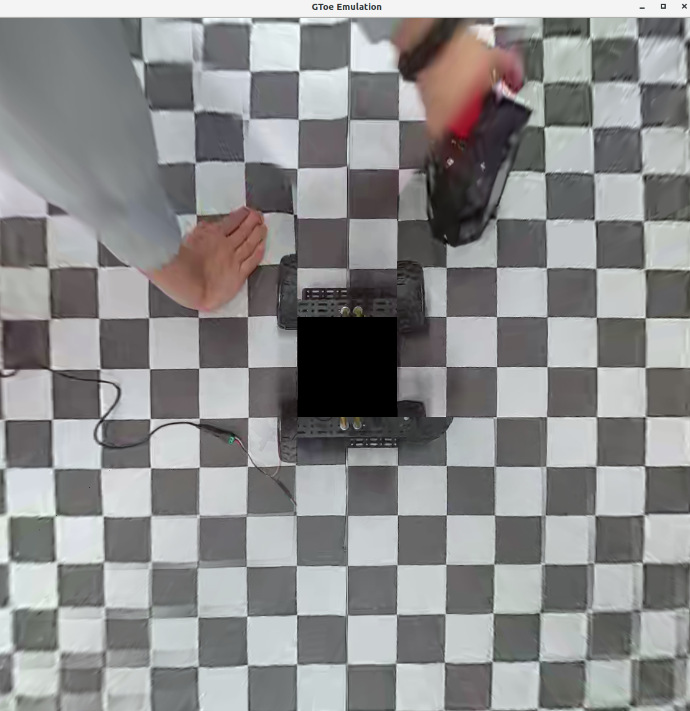

 Hello~! My name is Yuhao Cao. I am now living in Guangdong, ShenZhen, pursuing my Master's degree in Control Engineering in **Harbin Institute of Technology(ShenZhen)**. Also,I received my bachelor's degree from HITSZ. Now I am a member of [nROS-lab](https://www.nrs-lab.com/), who is doing research and projects on the ground robots for disaster rescue.

Skills 
======
- Python ⭐⭐⭐⭐
- C++ ⭐⭐⭐
- Pytorch ⭐⭐⭐
- ROS(Robot Operating System) ⭐⭐⭐⭐
- CMake/xmake ⭐⭐⭐
- OpenGL ⭐⭐
- Some Web languages(JS/HTML/CSS) ⭐⭐

Projects
======
<table>
<td  width="45%" style="vertical-align:middle;">
     <iframe width="354px" height="225px" src="https://player.bilibili.com/player.html?isOutside=true&aid=113062933695302&bvid=BV173Hqe2EW3&cid=25694374217&p=1" scrolling="no" border="0" frameborder="0" framespacing="0"> </iframe> </td>
<td width="55%" style="vertical-align:top;">
    <big><big><strong>Apple Vision Pro teleoperation </strong></big></big> 
       We implemented the Demo of <a href="https://github.com/unitreerobotics/avp_teleoperate">TeleVison</a>.
       We use the realman RM65 arm and the Inspire dexterous hand to build the experiment platform.Hand retargeting is solved using <a href="https://github.com/dexsuite/dex-retargeting">dexipilot</a>.The message communication is implemented by gRPC. 
    </td>
</table> 

<table>
<td  width="45%" style="vertical-align:middle;">
     <iframe width="354px" height="225px" src="https://player.bilibili.com/player.html?isOutside=true&aid=706447463&bvid=BV1eQ4y1t7cz&cid=1345809450&p=1" scrolling="no" border="0" frameborder="0" framespacing="0"> </iframe> </td>
<td width="55%" style="vertical-align:top;">
    <big><big><strong>VR Immersive Viuslization </strong></big></big> 
       Using <a href="https://github.com/hku-mars/r3live">R3LIVE</a> as the odometry and provide RGB colorful pointcloud for VR user to visualize the scene where the robot is in real time.I programm the application with OpenXR for VR development to realize high performance rendering.
    </td>
</table> 

<table>
<td  width="50%" style="vertical-align:middle;">
      </td>
<td width="50%" style="vertical-align:top;">
    <big><big><strong>Camera Surround Stitching </strong></big></big> 
       首届“星闪杯”高校应用挑战赛是面向高校开发者的命题应用挑战赛，由国际星闪联盟联合多所高校联合举办。赛题为摄像头环视拼接系统的开发，使用C++在指定平台上完成无人车鸟瞰图的融合拼接，做到拼接处无明显痕迹，图像全局亮度均衡，图像无明显畸变，运行流畅稳定。
    </td>
</table>

<table>
<td  width="45%" style="vertical-align:middle;">
     <iframe width="354px" height="225px" src="https://player.bilibili.com/player.html?isOutside=true&aid=613376126&bvid=BV1Uh4y1J7hN&cid=1124218431&p=1" scrolling="no" border="0" frameborder="0" framespacing="0"> </iframe> </td>
<td width="55%" style="vertical-align:top;">
    <big><big><strong>Tetris Robot </strong></big></big> 
    Using a robotic arm and an RGB camera with eyes outside the hand, it picks up the Tetris blocks and places them on the plate according to the specified rules.
    </td>
</table> 

------
Publications
======
ASAP....